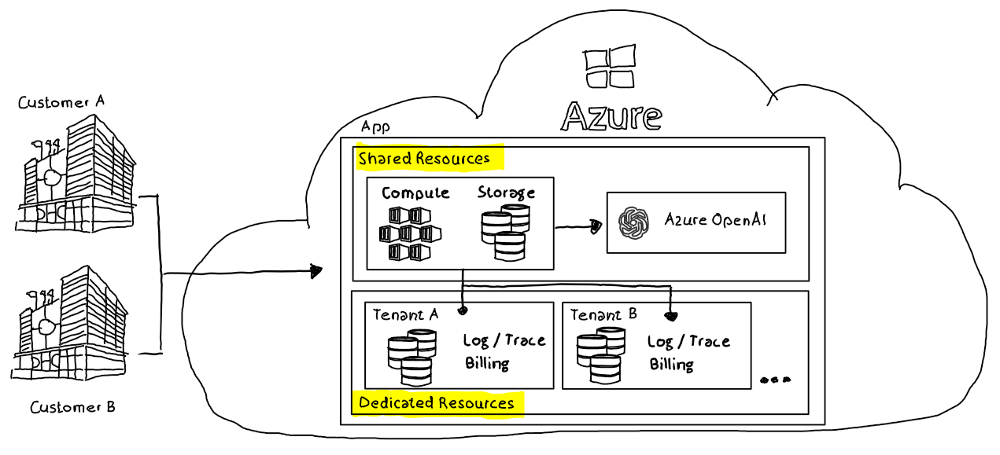

# Azure OpenAI .NET SDK - Implement multi-tenant solutions

.NET Azure OpenAI SDK extensibility to support the development of multi-tenant solutions.

## Challenge

ISVs who provide multi-tenant solutions to customers are challenged to use shared resources wherever applicable but also need to use dedicated tenant resources for specific scenarios. Those scenarios could be e.g. storing of billing information, storing of logs with sensitive information etc.



The .NET Azure OpenAI SDK provides functionality to implement custom processing pipelines which can be used to implement tenant specific handling or storing of data.

## .NET SDK Extensibility

### Custom HttpPipelinePolicy

A `HttpPipelinePolicy` is an extension point for the HttpPipeline used by the SDK to call the Azure OpenAI model. The HttpPipeline can modify requests to Azure OpenAI and process responses before they are presented to the caller.

`OpenAIClient` takes during instance creation an `OpenAIClientOptions` parameter where a custom `HttpPipelinePolicy` implementation can be provided. In this example it's an instance of the custom class `MultiTenantPolicy` which inherits from `HttpPipelinePolicy`.

```csharp
//Create OpenAIClient with custom HttpPipelinePolicy
OpenAIClientOptions openAIClientOptions = new OpenAIClientOptions(ServiceVersion.V2023_03_15_Preview); 
openAIClientOptions.AddPolicy(new MultiTenantPolicy(), HttpPipelinePosition.BeforeTransport);

OpenAIClient openAIClient = new OpenAIClient(new Uri(apiEndpoint), azureKeyCredential, openAIClientOptions);
```

[MultiTenantPolicy](src/PipelinePolicy/MultiTenantPolicy.cs) implements functionality to handle responses from the Azure OpenAI instance to allow tenant specific processing.

In this example billing information and OpenAI responses are extracted from the Azure OpenAI model response and can be easily processed according to the tenant needs. 

### Extension methods

To provide the `tenantId` to the processing pipeline two extension methods for `OpenAIClient`are provided in the class [OpenAIClientExtensions](src/PipelinePolicy/OpenAIClientExtensions.cs). Both methods accept a string `tenantId`:

- `GetChatCompletionsAsync` for asynchronous communication with the Azure OpenAI's model chat interface
- `GetChatCompletions` for synchronous communication with the Azure OpenAI's model chat interface

The tenant information is provided to the processing pipeline as part of the `Chat.Role` System BUT is not provided to the LLM. The `MultiTenantPolicy` implementation removes the information before it will be posted and just uses it for the tenant specific handling of responses.

## Repo Content

- An [Azure CLI script](src/CreateEnv/CreateEnv.azcli) to create all Azure resources to run the demo. After running the script necessary credentials (API KEY), endpoint information (API Endpoint) and model deployment name are provided in environment variables.
- A simplified [c# .NET console application](src/client) which performs calls against the Azure OpenAI model instance using the custom `MultiTenantPolicy` and the Open AI Client extensions.
- A simplified [c# .NET classlib](src/PipelinePolicy/) which implements a custom HttpPipelinePolicy (`MultiTenantPolicy`) and provides extension methods to call `GetChatCompletionsAsync()` and `GetChatCompletions()` with a tenant id.

## Summary

The .NET Azure OpenAI SDK can be easily extended to provide centralized multi-tenant specific handling of requests and responses.

This can be easily integrated by:

- custom `HttpPipelinePolicy` pipelines
- extension methods of `GetChatCompletionsAsync()`and `GetChatCompletions()`
